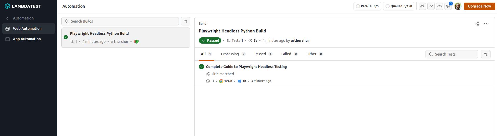

## Playwright Headless Testing

The purpose of this repository is to demonstrate Playwright headless browser testing. Playwright is a web testing framework and browser automation framework which enables reliable end-to-end testing for modern web apps.


### Setup and Installation

Before you proceed, ensure that you have **Python3.x** and **pip** install on your computer.

**Step 1:** Clone this repository and navigate to the code directory as shown below:

```bash
git clone https://github.com/ginjardev/playwright_headless_testing.git
```


```bash
cd playwright_headless_testing
```


**Step 2:** Create a virtual environment in your project folder with the following command on the terminal:

```bash
python3 -m venv env
```


**Step 3:** Activate the environment:

```bash
source env/bin/activate
```


**Step 4:** Install node package manager:

```bash
npm install
```


**Step 5:** Install the Pytest plugin:

```bash
pip install pytest-playwright
```


**Step 6:** Install required browsers:

```javascript
playwright install
```


**Step 7:** Install the dependencies  from the cloned project directory:

```bash
pip install -r requirements.txt
```


### Authentication

**Step 8:** Set [LambdaTest](https://www.lambdatest.com/) **Username** and **Access Key** in environment variables.

In order to run your tests on LambdaTest cloud platform, you will need to set your [LambdaTest profile](https://accounts.lambdatest.com/dashboard) username and access key in the environment variables. Click the **Access Key** button at the top-right of the Automation Dashboard to access it.

See image below:

 


* **Linux/mac OS**

```bash
export LT_USERNAME="YOUR_USERNAME" 
export LT_ACCESS_KEY="YOUR ACCESS KEY"
```

* **Windows**

```bash
set LT_USERNAME="YOUR_USERNAME" 
set LT_ACCESS_KEY="YOUR ACCESS KEY"
```


### Executing The Test

**Step 9:** From the base repository, execute the command below in your terminal.

```bash
pytest -s
```

Your test results would be displayed on the console (or command-line interface if you are using terminal) and on LambdaTest automation dashboard.


### Results

View test results on LambdaTest web automation dashboard.

 


